| Nama | Nova Tegar Adiyansyah |
| -------| ----------|
| Nim    | 312010145 |
| Kelas | TI.20.A1 |

# Langkah-langkah Praktikum 5  

Persiapan membuat dokumen HTML dengan nama file lab5_javascript.html seperti berikut  

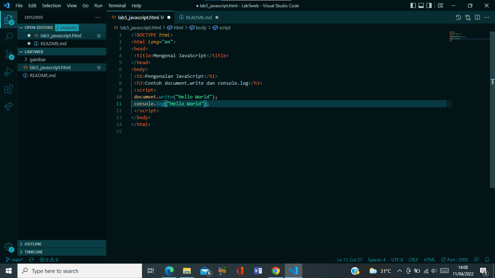

 

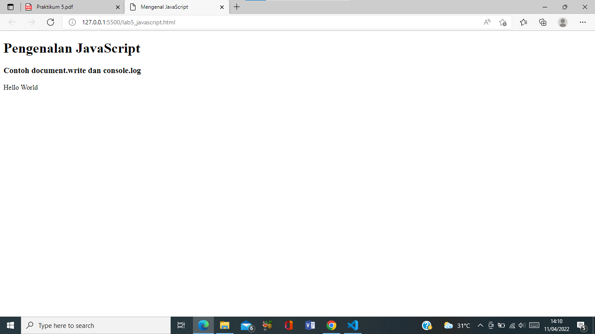

## 1. Javascript Dasar  

Pemakaian Alert sebagai property window. 

Pemakaian method dalam objek 

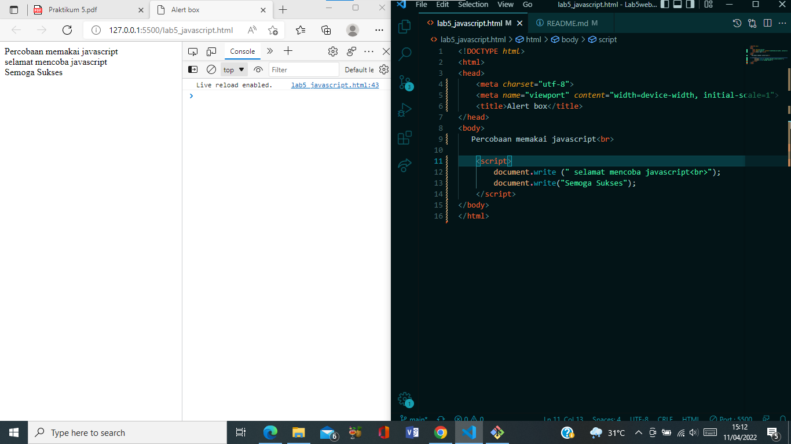

Pemakaian Prompt 

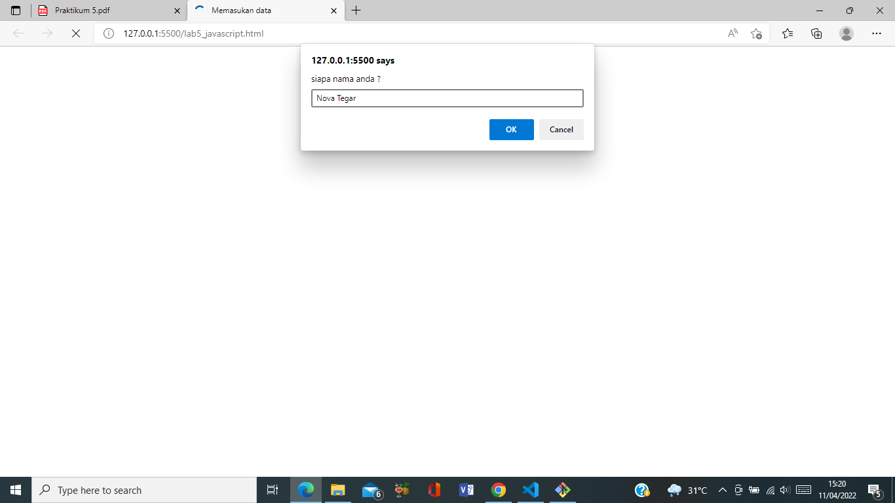

Pembuatan fungsi dan cara pemanggilan 

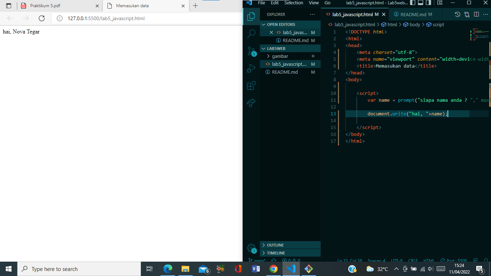

## 2. Dasar Pemrograman Di Javascript 

Operasi dasar aritmatika 

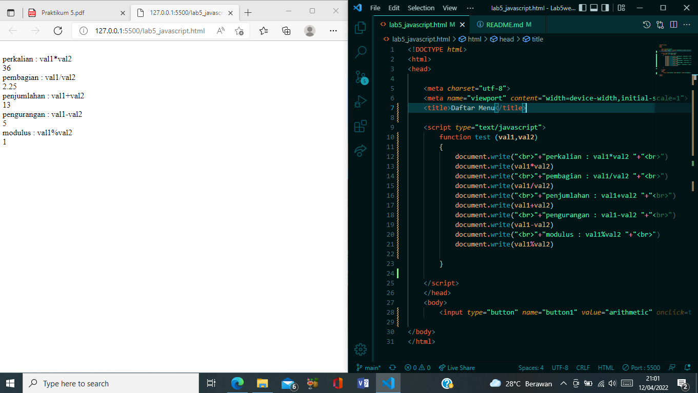

Seleksi kondisi (if..else) 

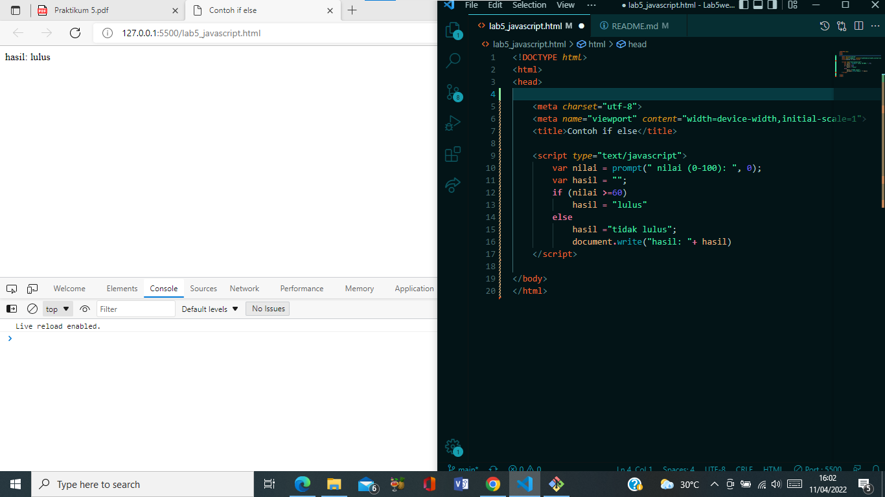

Penggunaan operator switch untuk seleksi kondisi 

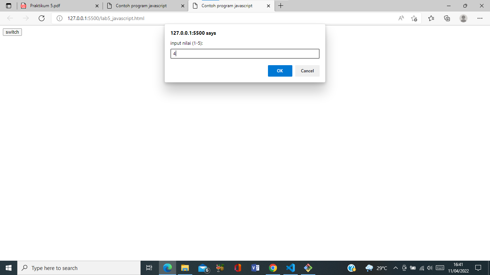

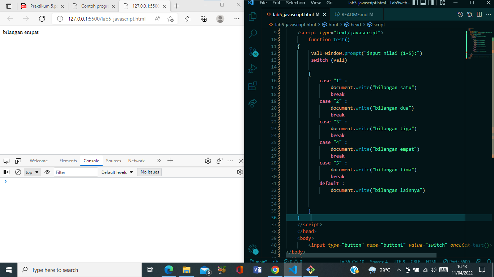

## 3. Pembuatan Form

Form Input 

saya mencoba input nilai 4  

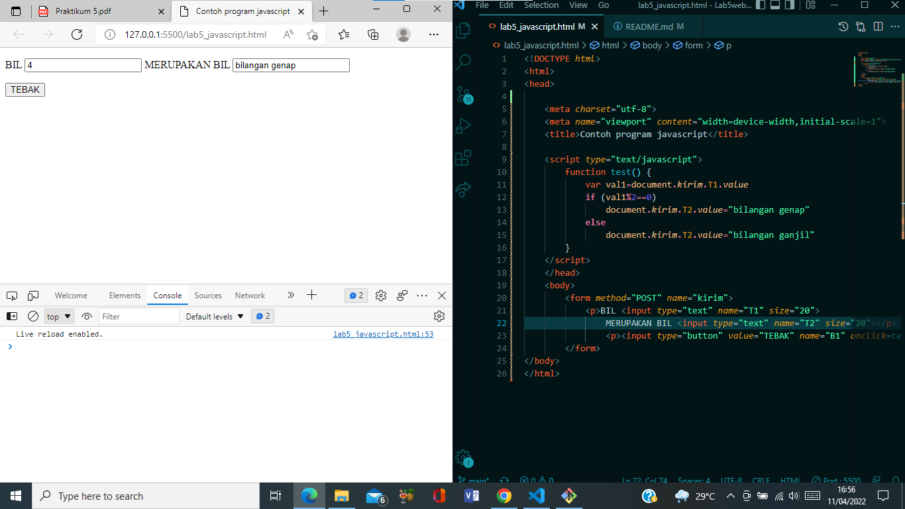

From Button 

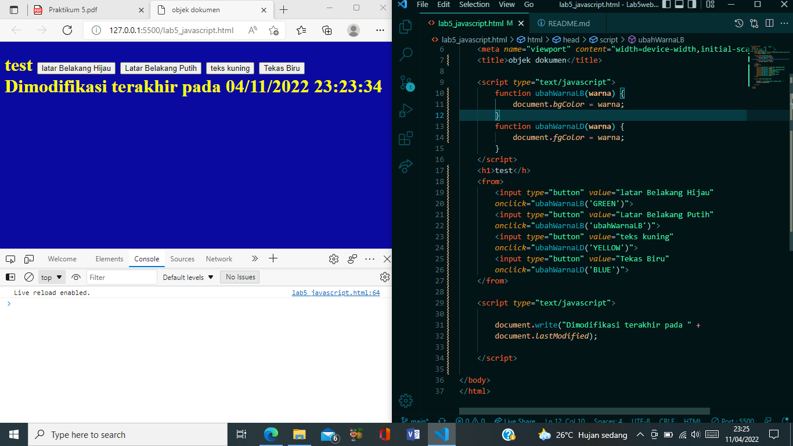 

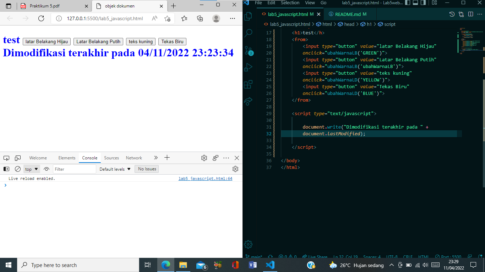

## 4. HTML DOM 

Pilihan menggunakan checkBox dengan perhitungan otomatis 

## Pertanyaan dan Tugas

    1. Buat script untuk melakukan validasi pada isian form.

## Jawaban

